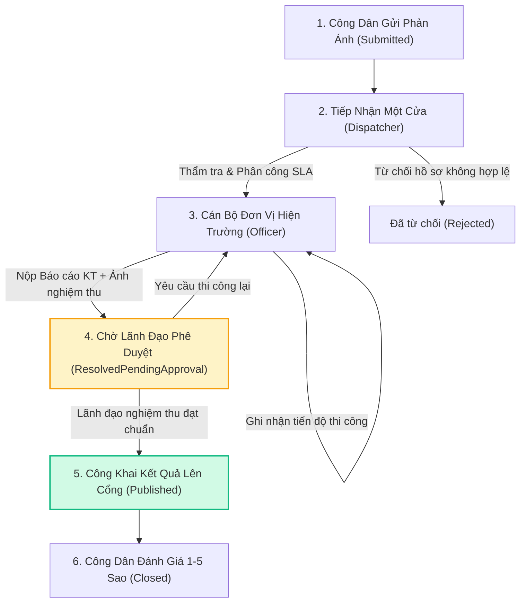

# 🏛️ ReflectGov - Nền Tảng Tiếp Nhận & Điều Hành Xử Lý Phản Ánh Công Dân

[](https://dotnet.microsoft.com/)
[](https://react.dev/)
[](https://www.typescriptlang.org/)
[](https://www.postgresql.org/)
[](https://tailwindcss.com/)
[](#-kiến-trúc-hệ-thống)
[](LICENSE)

**ReflectGov** là nền tảng Chính quyền số (Gov-Tech IOC Platform) phục vụ tiếp nhận, thẩm tra, phân công tự động, giám sát thi công hiện trường thời gian thực và quản lý hạn mức cam kết chất lượng dịch vụ công (**SLA - Service Level Agreement**). 

Hệ thống kết nối trực tiếp **Người Dân** với **Trung Tâm Tiếp Nhận Một Cửa**, **Các Phòng Ban Chuyên Trách** (Giao thông, Môi trường, Trật tự đô thị) và **Lãnh Đạo UBND Thành Phố**.

---

## 📑 Mục Lục
- [🌟 Tính Năng Nổi Bật](#-tính-năng-nổi-bật)
- [🏢 Ma Trận Phân Quyền Vai Trò (RBAC)](#-ma-trận-phân-quyền-vai-trò-rbac)
- [⛓️ Quy Trình Nghiệp Vụ Tuần Tự (Lifecycle)](#️-quy-trình-nghiệp-vụ-tuần-tự-lifecycle)
- [🏛️ Kiến Trúc Hệ Thống (Clean Architecture)](#️-kiến-trúc-hệ-thống-clean-architecture)
- [🛠️ Công Nghệ Sử Dụng (Tech Stack)](#️-công-nghệ-sử-dụng-tech-stack)
- [📂 Cấu Trúc Thư Mục Dự Án](#-cấu-trúc-thư-mục-dự-án)
- [🚀 Hướng Dẫn Khởi Chạy Ứng Dụng](#-hướng-dẫn-khởi-chạy-ứng-dụng)
- [🔑 Danh Sách Tài Khoản & Mật Khẩu Thử Nghiệm](#-danh-sách-tài-khoản--mật-khẩu-thử-nghiệm)
- [📡 Danh Mục RESTful API](#-danh-mục-restful-api)
- [🗺️ Lộ Trình Phát Triển Tương Lai (Roadmap)](#️-lộ-trình-phát-triển-tương-lai-roadmap)

---

## 🌟 Tính Năng Nổi Bật

### 1. Cổng Dịch Vụ Công Người Dân (`/`)
* **Gửi phản ánh trực quan 30 giây (`/submit`)**: Chụp/tải ảnh hiện trường, bản đồ số **CartoDB Voyager CDN** mượt mà, tự động bóc tách số nhà ngõ ngách, tên đường, phường/xã (**Photon Reverse Geocoding**).
* **Tra cứu tiến độ thời gian thực (`/track`)**: Stepper 4 bước trực quan, nhật ký thi công hiện trường, đối chiếu ảnh **Trước / Sau xử lý**.
* **Đánh giá mức độ hài lòng 1-5 sao**: Người dân (kể cả chưa đăng nhập) có thể chấm điểm sao và nhận xét minh bạch. Dữ liệu đánh giá được hệ thống liên kết trực tiếp vào **Điểm KPI của Cán bộ thụ lý** và **Chỉ số chất lượng của Phòng ban**.
* **Bản đồ GIS phản ánh số (`/map`)**: Bản đồ nhiệt toàn thành phố, lọc theo 6 chuyên ngành đô thị (Giao thông, Môi trường, Trật tự đô thị, Chiếu sáng, Cây xanh, An ninh).

### 2. Trung Tâm Điều Hành IOC & Bàn Làm Việc Cán Bộ (`/admin`)
* **Bảng điều khiển KPI & SLA Alerts**: 4 chỉ số KPI tổng thể, biểu đồ phân bổ chuyên ngành, biểu đồ cột khối lượng tiếp nhận/giải quyết 4 tuần gần nhất và danh sách cảnh báo hồ sơ quá hạn/sắp đến hạn.
* **Quản lý Kanban Board 3 cột**: Kéo thả và theo dõi theo 3 trạng thái nghiệp vụ (*Chờ tiếp nhận*, *Đang xử lý*, *Hoàn thành*) hoặc chuyển đổi sang **Table View** đa bộ lọc.
* **Modal 5 nghiệp vụ cán bộ chuyên sâu**: Thẩm tra (`Verify`), Phân công đơn vị & SLA (`Assign`), Cập nhật tiến độ hiện trường (`Progress`), Báo cáo hoàn thành nộp ảnh nghiệm thu (`Resolve`), Lãnh đạo phê duyệt công khai (`Approve`).
* **Quản trị người dùng & Phân quyền cán bộ (`/admin/users`)**: Thêm mới, phân bổ đơn vị công tác và khóa/mở khóa tài khoản cán bộ kèm hộp thoại xác nhận.

### 3. Phân Quyền Nghiêm Ngặt & Ranh Giới Nghiệp Vụ Chuyên Nghiệp
* **Phân tách Cổng Công Dân (`/login`) và Cổng Cán Bộ (`/admin/login`)**: Yêu cầu **Mã Định Danh Bảo Mật Công Vụ (Gov PIN: `GOV-2026`)** mới mở khóa danh sách bộ phận điều hành.
* **Chặn Cán bộ gửi phản ánh công dân**: Tài khoản Cán bộ thi hành công vụ không được gửi phản ánh trên Cổng dân nhằm chống tạo hồ sơ ảo (chặn cả giao diện và Backend 403).
* **Chặn Cán bộ tự chấm điểm sao**: Cán bộ không được tự đánh giá hồ sơ mình hoặc đồng nghiệp xử lý; quyền chấm điểm sao thuộc về công dân phản ánh.
* **Hộp thoại xác nhận (Confirm Dialogs)**: Mọi thao tác Đăng xuất hoặc Khóa tài khoản đều có hộp thoại xác nhận để tránh bấm nhầm.

---

## 🏢 Ma Trận Phân Quyền Vai Trò (RBAC)

| Nghiệp Vụ & Quyền Hạn | 🧑‍💼 Công Dân (`Citizen`) | 📋 Cán Bộ Một Cửa (`Dispatcher`) | 🚗 Cán Bộ Hiện Trường (`Officer`) | 👑 Lãnh Đạo / Admin (`Admin`) |
| :--- | :---: | :---: | :---: | :---: |
| **Gửi phản ánh, tra cứu & đánh giá 5 sao** | ✅ Cho phép | ❌ Bị chặn (403) | ❌ Bị chặn (403) | ❌ Bị chặn (403) |
| **Xem Dashboard KPI & Cảnh báo SLA** | ❌ 403 Forbidden | ✅ Cho phép | ✅ Cho phép (theo phòng ban) | ✅ Toàn quyền |
| **Thẩm tra hồ sơ (Hợp lệ / Từ chối)** | ❌ 403 Forbidden | ✅ **Nhiệm vụ chính** | ❌ 403 Forbidden | ✅ Toàn quyền |
| **Phân công đơn vị, Cán bộ & SLA** | ❌ 403 Forbidden | ✅ **Nhiệm vụ chính** | ❌ 403 Forbidden | ✅ Toàn quyền |
| **Cập nhật tiến độ thi công hiện trường** | ❌ 403 Forbidden | ❌ 403 Forbidden | ✅ **Nhiệm vụ chính** | ✅ Toàn quyền |
| **Báo cáo hoàn thành & Nộp ảnh nghiệm thu** | ❌ 403 Forbidden | ❌ 403 Forbidden | ✅ **Nhiệm vụ chính** | ✅ Toàn quyền |
| **Nghiệm thu phê duyệt công khai kết quả** | ❌ 403 Forbidden | ❌ 403 Forbidden | ❌ 403 Forbidden | ✅ **Duy nhất Lãnh đạo** |
| **Quản lý Cán bộ & Khóa/Mở tài khoản** | ❌ 403 Forbidden | ❌ 403 Forbidden | ❌ 403 Forbidden | ✅ **Duy nhất Admin** |

---

## ⛓️ Quy Trình Nghiệp Vụ Tuần Tự (Lifecycle)

Hệ thống bắt buộc tuân thủ chặt chẽ chu trình nghiệp vụ, **không cho phép nghiệm thu tắt** khi cán bộ hiện trường chưa nộp báo cáo hoàn thành:



---

## 🏛️ Kiến Trúc Hệ Thống (Clean Architecture)

Hệ thống được tổ chức theo chuẩn **Clean Architecture 4 tầng** nhằm đảm bảo khả năng mở rộng, bảo trì và kiểm thử độc lập:

```
ReflectGov/
├── backend/
│   ├── ReflectGov.Domain/          # Tầng 1: Core Domain Entities, Enums, Constants
│   ├── ReflectGov.Infrastructure/  # Tầng 2: EF Core DbContext, Npgsql PostgreSQL, Storage
│   ├── ReflectGov.Application/     # Tầng 3: Business Services, DTOs, Mapping, Validators
│   └── ReflectGov.Api/             # Tầng 4: RESTful Web API Controllers, Middleware, Auth
└── frontend/                       # Tầng Giao diện: React 19, TypeScript, Vite, Tailwind CSS
```

---

## 🛠️ Công Nghệ Sử Dụng (Tech Stack)

| Thành Phần | Công Nghệ / Thư Viện | Mục Đích Sử Dụng |
| :--- | :--- | :--- |
| **Backend Runtime** | **.NET 9 Web API (C# 13)** | Xây dựng RESTful Services hiệu năng cao |
| **Database Engine** | **PostgreSQL 18.x** | Cơ sở dữ liệu quan hệ lưu trữ tập trung `reflectgov_db` |
| **ORM / Data Access** | **Npgsql.EntityFrameworkCore.PostgreSQL** | ORM quản trị dữ liệu, Migration & Seeding tự động |
| **Security** | **JWT Bearer + BCrypt.Net** | Xác thực phân quyền Role-based, mã hóa mật khẩu |
| **Frontend Framework** | **React 19 + TypeScript** | Xây dựng giao diện Single Page Application (SPA) |
| **Build Tool & Bundler**| **Vite 8** | Hot Module Replacement (HMR) và tối ưu hóa đóng gói |
| **Styling** | **Tailwind CSS + PostCSS** | Thiết kế giao diện hiện đại chuẩn Gov-Tech |
| **Bản Đồ & GIS** | **Leaflet + CartoDB Voyager CDN** | Bản đồ tương tác vệ tinh và hiển thị tọa độ |
| **Geocoding** | **Photon Geocoding API** | Bóc tách chi tiết số nhà, ngõ ngách, tên đường |
| **Biểu Đồ & Thống Kê** | **Recharts** | Biểu đồ Donut, Bar Chart khối lượng giải quyết |
| **Icons** | **Lucide React** | Bộ icon vector trực quan, nhất quán |

---

## 📂 Cấu Trúc Thư Mục Dự Án

```text
ReflectGov/
├── backend/
│   ├── ReflectGov.Domain/              # Thực thể Domain (Feedback, User, Category...)
│   ├── ReflectGov.Infrastructure/      # Cấu hình EF Core Npgsql, DbInitializer, FileStorage
│   ├── ReflectGov.Application/         # DTOs, FeedbackService, StatsService, AuthService
│   └── ReflectGov.Api/                 # 7 Controllers, Program.cs, appsettings.json
├── frontend/
│   ├── src/
│   │   ├── components/
│   │   │   ├── admin/                  # AdminLayout, Dashboard, Kanban, ActionModal, Users
│   │   │   ├── citizen/                # HomePage, SubmitFeedback, TrackingDetail, MapPage
│   │   │   ├── auth/                   # LoginPage (Dân), OfficerLoginPage (Cán bộ)
│   │   │   └── common/                 # Navbar, Footer, StatusBadge, PriorityBadge, ConfirmModal
│   │   ├── context/                    # AuthContext quản lý phiên đăng nhập
│   │   ├── services/                   # Axios API Client kết nối Backend
│   │   └── types/                      # TypeScript Interface DTOs
│   └── tailwind.config.js              # Cấu hình bảng màu Gov-Tech
└── docs/                               # Hồ sơ thiết kế & Báo cáo kỹ thuật chi tiết
```

---

## 🚀 Hướng Dẫn Khởi Chạy Ứng Dụng

### 1. Khởi chạy Backend API (.NET 9 + PostgreSQL)
```bash
# 1. Di chuyển vào thư mục backend
cd backend/ReflectGov.Api

# 2. Khởi chạy Web API
dotnet run --launch-profile http

# API Backend chạy tại: http://localhost:5000
# Swagger API Docs:    http://localhost:5000/swagger
```

---

### 2. Khởi chạy Frontend Web (React 19 + Vite)
```bash
# 1. Di chuyển vào thư mục frontend
cd frontend

# 2. Cài đặt các gói phụ thuộc (chỉ cần chạy lần đầu)
npm install

# 3. Chạy môi trường phát triển
npm run dev

# Ứng dụng web mở tại: http://localhost:5173
```

---

## 🔑 Danh Sách Tài Khoản & Mật Khẩu Thử Nghiệm

> 💡 **Mật khẩu mặc định cho toàn bộ tài khoản**: **`123456`**  
> 🔒 **Mã PIN Công Vụ nội bộ**: **`GOV-2026`**

| Vai Trò | Tên Tài Khoản | Cán Bộ Đại Diện | Phòng Ban / Cơ Quan | Quyền Hạn Nghiệp Vụ | Cổng Đăng Nhập |
| :--- | :---: | :--- | :--- | :--- | :---: |
| **Tiếp Nhận Một Cửa** | **`tiepnhan`** | Bà Trần Thị Tiếp Nhận | Trung Tâm Phục Vụ Hành Chính Công | Thẩm tra, sơ loại & giao việc kèm SLA | `/admin/login` |
| **Lãnh Đạo / Admin** | **`admin`** | Ông Nguyễn Văn Quản Trị | Văn Phòng UBND Thành Phố | Giám sát KPI, Phê duyệt công khai & Quản trị cán bộ | `/admin/login` |
| **Cán Bộ Giao Thông** | **`canbo_giaothong`** | Ông Vũ Tuấn Giao Thông | Đơn Vị Quản Lý Giao Thông & Hạ Tầng | Xử lý sụt lún, ổ gà, đèn tín hiệu & nộp ảnh | `/admin/login` |
| **Cán Bộ Môi Trường** | **`canbo_moitruong`** | Ông Phạm Minh Môi Trường | Phòng Tài Nguyên & Môi Trường | Xử lý rác thải sinh hoạt, ô nhiễm cống rãnh | `/admin/login` |
| **Cán Bộ Trật Tự Đô Thị** | **`canbo_dothi`** | Ông Lê Hoàng Đô Thị | Đội Quản Lý Trật Tự Đô Thị & Xây Dựng | Xử lý lấn chiếm vỉa hè, biển hiệu vi phạm | `/admin/login` |
| **Công Dân Mẫu** | **`congdan`** | Ông Nguyễn Văn A | Cổng Dịch Vụ Công Trực Tuyến | Gửi phản ánh, tra cứu tiến độ & đánh giá sao | `/login` |

---

## 📡 Danh Mục RESTful API

| Phương Thức | Đường Dẫn Endpoint | Quyền Hạn (Role) | Mô Tả Chức Năng |
| :---: | :--- | :---: | :--- |
| `POST` | `/api/auth/login` | Public | Đăng nhập hệ thống (Cấp JWT Token) |
| `POST` | `/api/auth/register` | Public | Đăng ký tài khoản công dân mới |
| `GET` | `/api/auth/me` | Logged In | Lấy thông tin tài khoản đang đăng nhập |
| `POST` | `/api/feedbacks` | Public (Chỉ Công Dân) | Gửi phản ánh hiện trường kèm tệp đính kèm |
| `GET` | `/api/feedbacks/track/{code}` | Public | Tra cứu chi tiết tiến độ phản ánh theo mã `PA-xxxx` |
| `POST` | `/api/feedbacks/{id}/rate` | Public / Citizen | Đánh giá chất lượng 1-5 sao và góp ý |
| `GET` | `/api/feedbacks/public` | Public | Danh sách phản ánh công khai trên bản đồ GIS |
| `GET` | `/api/admin/feedbacks` | Dispatcher, Officer, Admin | Danh sách phản ánh cho Kanban & Table View |
| `POST` | `/api/admin/feedbacks/{id}/verify` | Dispatcher, Admin | Thẩm tra tiếp nhận hợp lệ hoặc từ chối |
| `POST` | `/api/admin/feedbacks/{id}/assign` | Dispatcher, Admin | Phân công đơn vị, cán bộ & thiết lập SLA |
| `POST` | `/api/admin/feedbacks/{id}/progress` | Officer, Admin | Cập nhật nhật ký tiến độ thi công hiện trường |
| `POST` | `/api/admin/feedbacks/{id}/resolve` | Officer, Admin | Báo cáo hoàn thành và nộp ảnh nghiệm thu |
| `POST` | `/api/admin/feedbacks/{id}/approve` | **Duy nhất Admin** | Lãnh đạo nghiệm thu phê duyệt công khai kết quả |
| `GET` | `/api/stats/dashboard` | Dispatcher, Officer, Admin | Báo cáo chỉ số KPI, biểu đồ tuần và cảnh báo SLA |
| `GET` | `/api/categories` | Public | Danh mục 6 chuyên ngành phản ánh |
| `GET` | `/api/departments` | Logged In | Danh mục các phòng ban, đơn vị trực thuộc |
| `GET` | `/api/users` | Dispatcher, Officer, Admin | Danh bạ cán bộ phục vụ phân công |
| `PATCH`| `/api/users/{id}/toggle-active` | **Duy nhất Admin** | Khóa hoặc mở khóa tài khoản cán bộ |

---

## 🗺️ Lộ Trình Phát Triển Tương Lai (Roadmap)

- [x] **Giai đoạn 1**: Kiến trúc Clean Architecture, Core Entities & Database Seeder.
- [x] **Giai đoạn 2**: Cổng dịch vụ công người dân, Bản đồ CartoDB Voyager & Photon Geocoding.
- [x] **Giai đoạn 3**: Trung tâm điều hành IOC, Kanban Board 3 cột, Biểu đồ thống kê Recharts.
- [x] **Giai đoạn 4**: Phân quyền RBAC 4 vai trò, Ràng buộc quy trình tuần tự nghiêm ngặt.
- [x] **Giai đoạn 5**: Phân tách Cổng đăng nhập riêng biệt với Mã định danh công vụ PIN.
- [x] **Giai đoạn 6**: Chuyển đổi và vận hành toàn diện trên **PostgreSQL 18 (Npgsql)**.
- [x] **Giai đoạn 7**: Thiết lập ranh giới công vụ chuyên nghiệp (Chặn cán bộ gửi phản ánh công dân & tự chấm điểm sao).
- [ ] **Giai đoạn 8 (Kế tiếp)**: Tích hợp **AI Image Classification** tự động nhận diện ổ gà / rác thải để gợi ý phân loại lĩnh vực tức thì.
- [ ] **Giai đoạn 9**: Tích hợp Zalo Mini App và Cổng gửi tin nhắn SMS Brandname thông báo tiến độ cho người dân.
- [ ] **Giai đoạn 10**: Bản đồ nhiệt GIS Heatmap phân tích điểm nóng hạ tầng đô thị phục vụ quy hoạch thành phố.

---

## 📄 Bản Quyền & Giấy Phép
Dự án được phát triển theo tiêu chuẩn mã nguồn mở **MIT License**. Mọi đóng góp và phát triển mở rộng vì mục tiêu Chính quyền số phục vụ cộng đồng đều được hoan nghênh.
