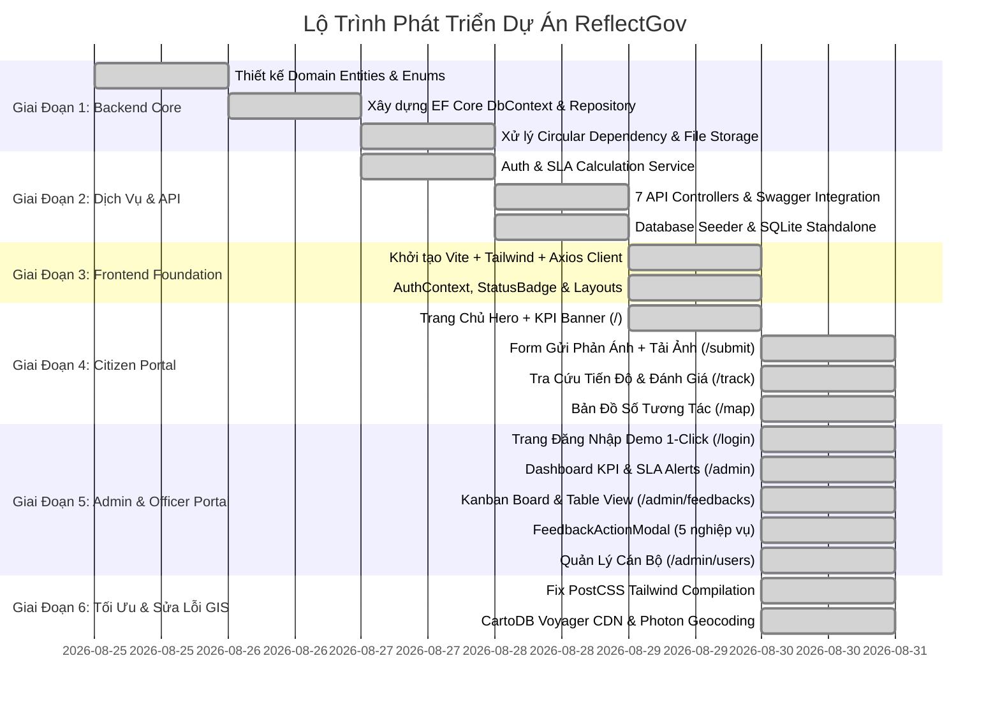
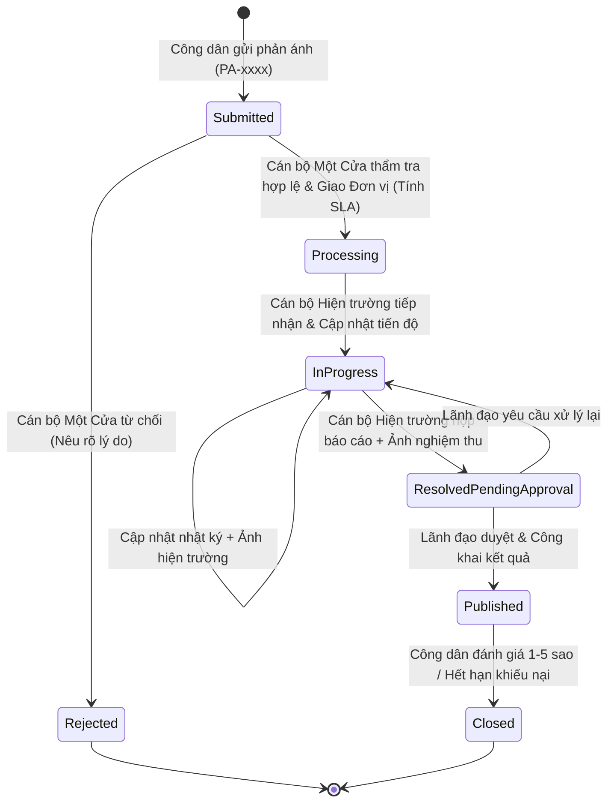

# BÁO CÁO TỔNG THỂ & BÀN GIAO TOÀN DIỆN DỰ ÁN REFLECTGOV

> **Cổng Tiếp Nhận, Điều Phối & Giám Sát Phản Ánh Đô Thị Thời Gian Thực**
> *Tương thích 100% với Nguyên Mẫu Thiết Kế Stitch "Citizen Feedback & Response Portal"*

---

## MỤC LỤC
1. [Phần 1: Tổng Quan Về Dự Án](#phần-1-tổng-quan-về-dự-án)
2. [Phần 2: Chi Tiết Từng Giai Đoạn & Thứ Tự Phát Triển (Task Breakdown)](#phần-2-chi-tiết-từng-giai-đoạn--thứ-tự-phát-triển-task-breakdown)
3. [Phần 3: Kiến Trúc & Cách Thức Vận Hành Toàn Bộ Hệ Thống](#phần-3-kiến-trúc--cách-thức-vận-hành-toàn-bộ-hệ-thống)
4. [Phần 4: Hướng Dẫn Kiểm Thử (API, Database, E2E Chức Năng)](#phần-4-hướng-dẫn-kiểm-thử-api-database-e2e-chức-năng)
5. [Phần 5: Cẩm Nang Hướng Dẫn Sử Dụng Web Cho Công Dân & Cán Bộ](#phần-5-cẩm-nang-hướng-dẫn-sử-dụng-web-cho-công-dân--cán-bộ)

---

# PHẦN 1: TỔNG QUAN VỀ DỰ ÁN

### 1.1. Sứ Mệnh & Bài Toán Giải Quyết
**ReflectGov** là nền tảng Chính quyền số (GovTech) phục vụ công tác **tiếp nhận, điều phối, xử lý hiện trường và công khai kết quả phản ánh - kiến nghị đô thị** giữa Công dân và Cơ quan Quản lý Nhà nước.

Hệ thống giải quyết triệt để các hạn chế của quy trình truyền thống:
- **Minh bạch hóa 100% tiến độ**: Công dân theo dõi trực tiếp hồ sơ qua bộ Visual Stepper 4 bước và đối chiếu ảnh *Trước & Sau xử lý*.
- **Kiểm soát thời hạn cam kết (SLA)**: Tự động tính toán deadline theo từng lĩnh vực (2h - 72h), cảnh báo tức thời các hồ sơ *Quá hạn (Overdue)* hoặc *Nguy cơ trễ hạn (At Risk)*.
- **Bàn làm việc số cho Cán bộ**: Hỗ trợ chuyển đổi linh hoạt giữa mô hình **Kanban Board** và **Bảng biểu (Table View)** để thao tác nhanh.
- **Bản đồ số đô thị & Định vị chính xác**: Tự động nhận diện số nhà, ngõ/ngách, tên đường khi công dân chấm điểm trên bản đồ.

### 1.2. Tech Stack Đầy Đủ
| Tầng Công Nghệ | Công Nghệ / Thư Viện Sử Dụng | Mục Đích |
| :--- | :--- | :--- |
| **Backend Framework** | ASP.NET Core 9 (C# 13, Clean Architecture) | Xây dựng RESTful API hiệu năng cao, Dependency Injection mạnh mẽ |
| **ORM & Database** | EF Core 9, SQLite (Local Mode) / PostgreSQL (Production) | Quản lý thực thể dữ liệu, quan hệ bảng và migration tự động |
| **Bảo Mật & Xác Thực** | JWT Bearer Token, BCrypt Password Hashing, Role-based Auth | Bảo vệ API endpoints theo 4 vai trò (Admin, Dispatcher, Officer, Citizen) |
| **Lưu Trữ Tệp** | Local File Storage (`/uploads`) + Multipart Form Data | Lưu trữ ảnh hiện trường ban đầu và ảnh nghiệm thu kết quả |
| **Frontend Framework** | React 19 + TypeScript + Vite | Giao diện Single Page Application hiện đại, tốc độ render tức thì |
| **Styling & Theme** | Tailwind CSS (Bảng màu Gov-tech Navy `#1b4d89` & Dark Slate `#0f294a`) | Chuẩn hóa UI/UX đồng bộ với Stitch Design System |
| **Bản Đồ Số (GIS)** | Leaflet, React-Leaflet, CartoDB Voyager CDN, Photon Reverse Geocoding | Bản đồ tương tác, nhận diện số nhà, ngõ ngách, tên đường tự động |
| **Biểu Đồ & Trực Quan Hóa** | Recharts (ResponsiveContainer, BarChart, PieChart) | Biểu đồ cột khối lượng tuần và biểu đồ tròn phân bổ lĩnh vực |
| **Biểu Tượng (Icons)** | Lucide React | Hệ thống icon vector nhất quán |

---

# PHẦN 2: CHI TIẾT TỪNG GIAI ĐOẠN & THỨ TỰ PHÁT TRIỂN (TASK BREAKDOWN)

Quá trình xây dựng dự án được thực hiện tuần tự theo quy chuẩn Kỹ nghệ phần mềm chuyên nghiệp:



### Chi Tiết Từng Task Đã Thực Hiện:
1. **Task 1.1 - Domain Layer**:
   - Định nghĩa 7 bảng thực thể: `Feedback`, `Category`, `Department`, `User`, `FeedbackAttachment`, `FeedbackLog`, `FeedbackRating`.
   - Thiết lập 7 trạng thái vòng đời: `Submitted` (1), `Processing` (2), `InProgress` (3), `ResolvedPendingApproval` (4), `Published` (5), `Rejected` (6), `Closed` (7).
2. **Task 1.2 - Infrastructure & EF Core**:
   - Cấu hình quan hệ 1-N (Category - Feedbacks, Department - Officers, Feedback - Logs/Attachments/Rating).
   - Tạo `IFileStorageService` và `LocalFileStorageService` phục vụ lưu trữ file đa phương tiện an toàn.
3. **Task 2.1 - Application Business Logic**:
   - Hiện thực `FeedbackService`: Tự động sinh mã tra cứu chuẩn `PA-YYYYMMDD-XXXX`, tính toán hạn SLA (`CreatedAt + SlaHours`), ghi nhận nhật ký stepper 4 bước.
   - Hiện thực `StatsService`: Tổng hợp số liệu KPI, biểu đồ cột 4 tuần gần nhất, biểu đồ tròn chuyên ngành và danh sách hồ sơ quá hạn SLA.
4. **Task 2.2 - Controllers & Seeding**:
   - Tạo 7 REST Controllers: `AuthController`, `FeedbacksController`, `AdminFeedbacksController`, `StatsController`, `CategoriesController`, `DepartmentsController`, `UsersController`.
   - Seed dữ liệu mẫu hoàn chỉnh khớp mockup Stitch (`#RPT-8492`, `REP-1042`, `REP-1045`, tài khoản demo).
5. **Task 3.1 - Frontend Foundation**:
   - Cấu hình bảng màu Gov-tech trong `tailwind.config.js` (`gov-700`: `#1b4d89`, `gov-950`: `#0f294a`).
   - Khởi tạo Axios client với Bearer Token interceptor và proxy Vite chuyển tiếp `/api` và `/uploads`.
6. **Task 4.1 - Cổng Công Dân (Citizen Portal)**:
   - `HomePage`: Hero banner tìm kiếm, 4 thẻ KPI động, danh sách phản ánh công khai.
   - `SubmitFeedbackPage`: Form gửi phản ánh, bộ chọn danh mục, tải tối đa 5 file ảnh/video, bản đồ số.
   - `TrackingDetailPage`: Stepper 4 bước, thư viện ảnh Before & After, nhật ký timeline, form chấm điểm 1-5 sao.
   - `MapPage`: Bản đồ toàn màn hình lọc theo lĩnh vực và từ khóa.
7. **Task 5.1 - Cổng Quản Trị & Điều Phối (Admin Portal)**:
   - `LoginPage`: Form đăng nhập chuyên nghiệp với các nút Demo 1-Click.
   - `DashboardOverview`: 4 thẻ KPI, SLA Alerts (Overdue/At Risk), Biểu đồ Recharts Weekly Volume và Category Distribution.
   - `FeedbackManagementPage`: Kanban View 3 cột (Open / In Progress / Resolved) và Table View.
   - `FeedbackActionModal`: Xử lý 5 tác vụ (Thẩm tra tiếp nhận, Phân công cán bộ & SLA, Cập nhật hiện trường, Báo cáo nghiệm thu hoàn thành, Lãnh đạo phê duyệt công khai).
   - `UserManagementPage`: Quản lý danh sách cán bộ, phòng ban và kích hoạt/khóa tài khoản.
8. **Task 6.1 - Hoàn Thiện & Tối Ưu GIS**:
   - Khắc phục cấu hình `postcss.config.js` để nạp toàn bộ Tailwind CSS.
   - Chuyển sang máy chủ bản đồ **CartoDB Voyager CDN** siêu tốc.
   - Tích hợp **Photon Reverse Geocoding** tự động bóc tách số nhà, ngõ/ngách, tên đường khi người dùng nhấp bản đồ.

---

# PHẦN 3: KIẾN TRÚC & CÁCH THỨC VẬN HÀNH TOÀN BỘ HỆ THỐNG

### 3.1. Sơ Đồ Vòng Đời Xử Lý Phản Ánh (Feedback Lifecycle)



### 3.2. Phân Quyền Vai Trò (Role-Based Access Control)
Hệ thống chia thành 4 nhóm quyền rõ ràng:
1. **Công Dân (Citizen)**:
   - Gửi phản ánh kèm ảnh/video và tọa độ GPS.
   - Tra cứu tiến độ hồ sơ qua mã phản ánh.
   - Đánh giá chất lượng xử lý (1-5 sao) và nhận xét sau khi hoàn thành.
2. **Cán Bộ Tiếp Nhận Một Cửa (Dispatcher)**:
   - Thẩm tra tính hợp lệ của phản ánh.
   - Phân công phòng ban chuyên trách, chọn mức độ ưu tiên và thiết lập hạn SLA (2h, 12h, 24h, 48h, 72h).
3. **Cán Bộ Hiện Trường (Officer)**:
   - Nhận việc được phân công, đến hiện trường kiểm tra.
   - Cập nhật tiến độ kèm ảnh minh chứng.
   - Báo cáo hoàn thành và nộp ảnh chụp kết quả nghiệm thu (Sau xử lý).
4. **Lãnh Đạo / Quản Trị Viên (Admin)**:
   - Giám sát toàn bộ Dashboard chỉ số KPI thời gian thực.
   - Nghiệm thu phê duyệt công khai kết quả xử lý lên Cổng.
   - Quản lý danh mục, phòng ban và tài khoản cán bộ.

---

# PHẦN 4: HƯỚNG DẪN KIỂM THỬ (API, DATABASE, E2E CHỨC NĂNG)

### 4.1. Khởi Chạy Môi Trường
1. **Backend API Server**:
   ```bash
   cd d:/ReflectGov
   dotnet run --project backend/ReflectGov.Api/ReflectGov.Api.csproj --launch-profile http
   ```
   - API chạy tại: `http://localhost:5000`
   - Tài liệu Swagger UI: `http://localhost:5000/swagger`

2. **Frontend Client**:
   ```bash
   cd d:/ReflectGov/frontend
   npm run dev
   ```
   - Web App chạy tại: `http://localhost:5173`

---

### 4.2. Danh Sách Tài Khoản Thử Nghiệm Sẵn Có
| Tên Tài Khoản | Mật Khẩu | Vai Trò | Phòng Ban | Quyền Hạn Chính |
| :--- | :--- | :--- | :--- | :--- |
| `admin` | `123456` | **Admin** | Toàn hệ thống | Xem Dashboard KPI, Phê duyệt công khai, Quản lý Cán bộ |
| `tiepnhan` | `123456` | **Dispatcher** | Bộ phận Một Cửa | Thẩm tra phản ánh, Phân công đơn vị & thiết lập hạn SLA |
| `canbo_giaothong` | `123456` | **Officer** | Phòng Quản lý Đô thị & Giao thông | Xử lý sự cố hạ tầng, cập nhật tiến độ, nộp ảnh hoàn thành |
| `canbo_moitruong` | `123456` | **Officer** | Phòng Tài nguyên & Môi trường | Xử lý rác thải, ô nhiễm môi trường |
| `canbo_dothi` | `123456` | **Officer** | Đội Quản lý Trật tự Đô thị | Xử lý trật tự vỉa hè, cây xanh |
| `congdan` | `123456` | **Citizen** | Người dân | Gửi phản ánh, theo dõi tiến độ |

---

### 4.3. Kịch Bản Kiểm Thử E2E Toàn Trình (End-to-End Test Case)

#### 🧪 Kịch Bản 1: Công Dân Gửi Phản Ánh & Định Vị Tự Động
1. Truy cập [http://localhost:5173/submit](http://localhost:5173/submit).
2. Chọn lĩnh vực **Giao thông đô thị**.
3. Nhập tiêu đề: *"Sụt lún mặt đường ngõ 116 Nguyễn Trãi gây nguy hiểm"*.
4. Nhập nội dung chi tiết.
5. Kéo thả 1-2 bức ảnh hiện trường.
6. **Kiểm tra Bản đồ số**: Nhấp vào một điểm bất kỳ trên bản đồ $\rightarrow$ Kiểm tra thấy ô *"Địa chỉ chi tiết"* tự động hiển thị số nhà/ngõ ngách/tên đường chính xác, và tọa độ GPS bên dưới được cập nhật.
7. Nhập thông tin người gửi: Nguyễn Văn A - `0987654321`.
8. Bấm **"Gửi phản ánh ngay"** $\rightarrow$ Hệ thống hiển thị Modal thành công và cấp mã tra cứu (ví dụ: `PA-20260830-xxxx`).
9. Bấm **"Sao chép"** mã tra cứu.

#### 🧪 Kịch Bản 2: Cán Bộ Một Cửa Thẩm Tra & Phân Công SLA
1. Bấm nút **"Cán bộ đăng nhập"** ở góc phải Navbar (hoặc vào [http://localhost:5173/login](http://localhost:5173/login)).
2. Bấm nút Demo **"📋 Tiếp nhận Một Cửa"** (`tiepnhan` / `123456`) $\rightarrow$ Bấm **"Đăng nhập hệ thống"**.
3. Hệ thống tự động chuyển vào `/admin`. Vào menu **"Quản lý Hồ sơ Phản ánh"** ([http://localhost:5173/admin/feedbacks](http://localhost:5173/admin/feedbacks)).
4. Tại cột **Chờ Tiếp Nhận (Open)**, tìm hồ sơ vừa gửi:
   - Bấm icon **Dấu tích xanh (Thẩm tra)** $\rightarrow$ Chọn *"Tiếp nhận hợp lệ"* $\rightarrow$ Bấm *"Xác nhận thực hiện"*.
   - Bấm icon **Thêm cán bộ (Phân công)** $\rightarrow$ Chọn đơn vị *"Phòng Quản lý Đô thị & Giao thông"*, chọn cán bộ *"canbo_giaothong"*, mức độ ưu tiên *"Khẩn cấp (Urgent)"*, hạn xử lý SLA *"2 Giờ"* $\rightarrow$ Bấm *"Xác nhận thực hiện"*.
5. Kiểm tra thấy thẻ hồ sơ tự động chuyển sang cột **Đang Xử Lý (In Progress)** với nhãn đếm ngược SLA.

#### 🧪 Kịch Bản 3: Cán Bộ Hiện Trường Cập Nhật Tiến Độ & Nộp Báo Cáo Hoàn Thành
1. Đăng xuất tài khoản `tiepnhan`, đăng nhập với tài khoản Demo **"🚗 Cán bộ Giao thông"** (`canbo_giaothong` / `123456`).
2. Vào **"Quản lý Hồ sơ Phản ánh"**:
   - Tại cột **Đang Xử Lý**, tìm hồ sơ được giao.
   - Bấm icon **Cờ lê (Tiến độ)** $\rightarrow$ Nhập ghi chú: *"Tổ công tác đã có mặt, đang đặt biển cảnh báo và tiến hành san gạt mặt đường"* $\rightarrow$ Bấm *"Xác nhận"*.
   - Bấm icon **Dấu tích đôi (Báo cáo xong)** $\rightarrow$ Nhập tóm tắt: *"Đã hoàn tất trải thảm bê tông nhựa nóng, kiểm tra an toàn và thông xe bình thường"*, tải lên 1 bức ảnh nghiệm thu $\rightarrow$ Bấm *"Xác nhận thực hiện"*.
3. Thẻ hồ sơ chuyển sang trạng thái chờ Lãnh đạo phê duyệt.

#### 🧪 Kịch Bản 4: Lãnh Đạo Phê Duyệt Công Khai Kết Quả & Xem Dashboard KPI
1. Đăng xuất, đăng nhập với tài khoản Demo **"👑 Quản trị viên"** (`admin` / `123456`).
2. Vào trang **"Tổng quan Chỉ số & KPI Đô thị"** ([http://localhost:5173/admin](http://localhost:5173/admin)):
   - Kiểm tra 4 thẻ KPI Summary hiển thị số liệu tính toán chuẩn xác.
   - Kiểm tra khối cảnh báo **SLA Alerts** (Overdue & At Risk).
   - Kiểm tra 2 biểu đồ **Recharts** (Weekly Resolution Volume & Category Distribution).
3. Vào **"Quản lý Hồ sơ Phản ánh"** $\rightarrow$ Bấm nút **"Duyệt công khai"** trên hồ sơ $\rightarrow$ Bấm *"Xác nhận"* $\rightarrow$ Hồ sơ chuyển sang cột **Hoàn Thành (Resolved)**.

#### 🧪 Kịch Bản 5: Công Dân Tra Cứu Tiến Độ & Chấm Điểm Sao Hài Lòng
1. Mở trang **"Theo dõi tiến độ"** ([http://localhost:5173/track](http://localhost:5173/track)).
2. Nhập mã tra cứu hồ sơ (hoặc tra cứu mã mẫu `#RPT-8492`).
3. **Kiểm tra giao diện người dân**:
   - Bộ **Visual Stepper 4 bước** hiển thị sáng đèn cả 4 bước (Đã gửi $\rightarrow$ Phân công $\rightarrow$ Đang xử lý $\rightarrow$ Hoàn thành).
   - Mục **Hình ảnh đối chiếu** hiển thị rõ 2 bên: *Ảnh trước xử lý* và *Ảnh sau xử lý*.
   - Mục **Nhật ký tiến trình** hiển thị đầy đủ timeline từng mốc thời gian và tên cán bộ thụ lý.
4. **Đánh giá chất lượng**: Chọn **5 Sao ⭐⭐⭐⭐⭐**, nhập nhận xét: *"Xử lý rất nhanh và sạch sẽ, cảm ơn chính quyền"* $\rightarrow$ Bấm **"Gửi đánh giá"** $\rightarrow$ Hệ thống ghi nhận điểm hài lòng và cập nhật trực tiếp vào KPI chung.

---

# PHẦN 5: CẨM NANG HƯỚNG DẪN SỬ DỤNG WEB

### 5.1. Dành Cho Người Dân (Công Dân)
- **Truy cập Trang chủ (`/`)**: Tìm kiếm nhanh mã phản ánh tại thanh Hero banner hoặc xem các phản ánh mới nhất của khu vực mình sinh sống.
- **Gửi phản ánh mới (`/submit`)**:
  - Bước 1: Chọn đúng lĩnh vực để hệ thống tự động gắn thời hạn cam kết SLA tương ứng.
  - Bước 2: Nhập tiêu đề và mô tả ngắn gọn, dễ hiểu.
  - Bước 3: Tải ảnh chụp hiện trường rõ nét.
  - Bước 4: Chấm vị trí trên bản đồ để hệ thống tự điền tên đường, số nhà hoặc ngõ phố.
  - Bước 5: Nhập số điện thoại để nhận thông báo kết quả.
  - Bước 6: Lưu lại **Mã tra cứu** (`PA-xxxx`) được cấp.
- **Tra cứu hồ sơ (`/track`)**: Nhập mã tra cứu bất kỳ lúc nào để xem tiến độ từng giờ của cán bộ.
- **Xem Bản đồ số (`/map`)**: Khám phá bản đồ đô thị toàn thành phố để biết các điểm phản ánh xung quanh mình.

---

### 5.2. Dành Cho Cán Bộ & Quản Trị Viên
- **Đăng nhập (`/login`)**: Sử dụng tài khoản công vụ được cấp (hoặc chọn tài khoản Demo để kiểm tra tính năng).
- **Xem Dashboard KPI (`/admin`)**:
  - Theo dõi tỷ lệ tuân thủ SLA (chỉ tiêu > 90%).
  - Theo dõi các hồ sơ nằm trong danh sách **Cảnh báo SLA (SLA Alerts)** để ưu tiên xử lý trước, tránh bị trễ hạn.
- **Bàn làm việc Quản lý Hồ sơ (`/admin/feedbacks`)**:
  - Chuyển đổi giữa chế độ **Kanban Board** (kéo xem luồng công việc trực quan) hoặc **Table View** (xem dạng bảng chi tiết).
  - Sử dụng thanh lọc để tìm nhanh theo Lĩnh vực, Phòng ban, Mức độ ưu tiên hoặc lọc riêng các hồ sơ Quá hạn (Overdue).
  - Sử dụng các nút tác vụ trên từng thẻ để Thẩm tra, Giao việc, Cập nhật tiến độ và Báo cáo hoàn thành.
- **Quản lý Cán bộ (`/admin/users`)**:
  - Xem danh sách nhân sự trực thuộc các phòng ban.
  - Thực hiện khóa hoặc mở khóa tài khoản khi có sự điều động nhân sự.

---

## TỔNG KẾT
Hệ thống **ReflectGov** đã được chuyển giao hoàn tất, mã nguồn sạch sẽ, kiểm thử tích hợp đầy đủ và sẵn sàng đưa vào vận hành thực tế phục vụ cộng đồng và chính quyền số.
