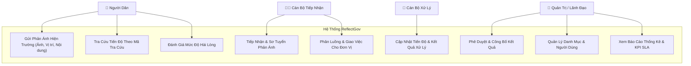
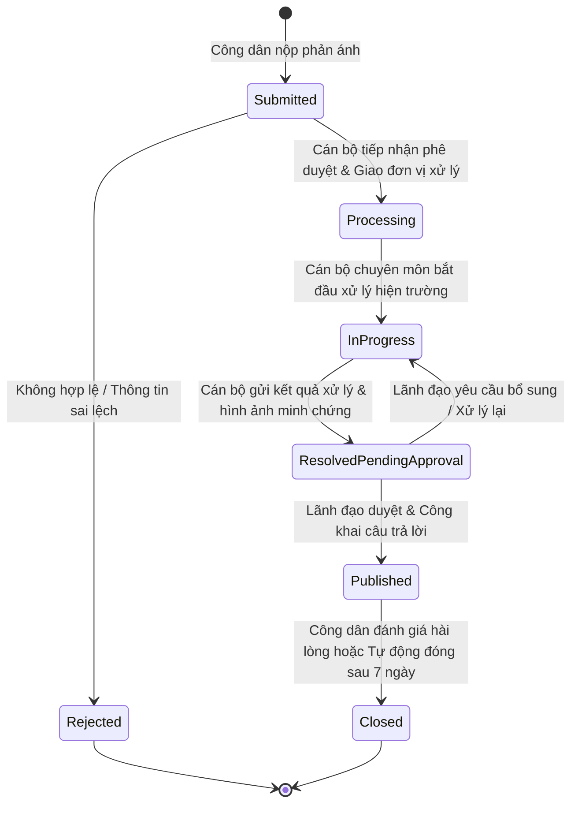
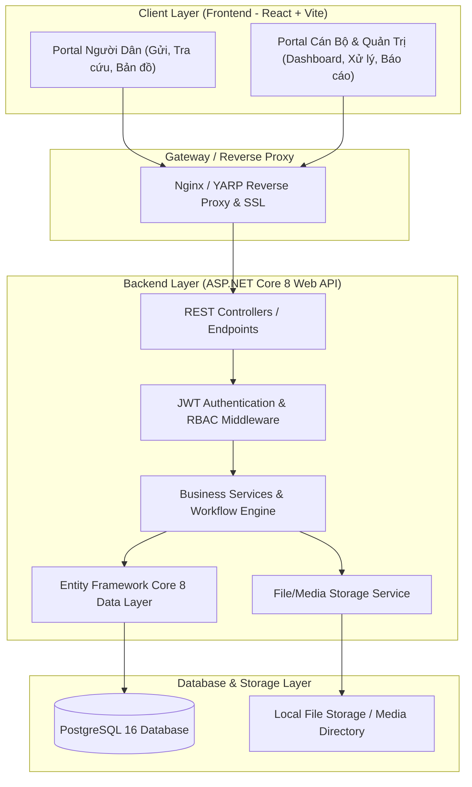
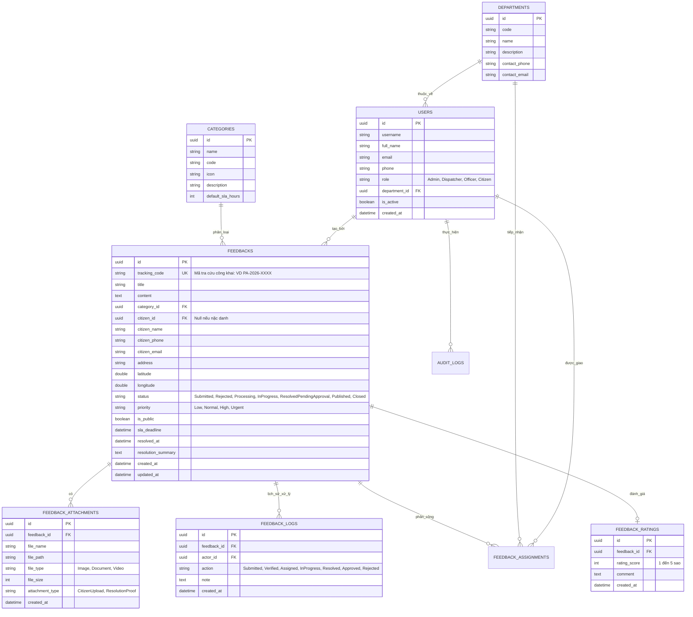

# Kế hoạch Thiết Kế Kiến Trúc & Phát Triển Hệ Thống ReflectGov
## (Hệ Thống Tiếp Nhận, Phân Luồng & Trả Lời Phản Ánh Kiến Nghị Công Dân)

---

## 📌 TỔNG QUAN DỰ ÁN & VAI TRÒ SENIOR DEVELOPER

Hệ thống **ReflectGov** là nền tảng số hoá cầu nối giữa **Người dân / Doanh nghiệp** và **Cơ quan Quản lý Nhà nước / Đơn vị Phụ trách**. Hệ thống cho phép người dân gửi phản ánh hiện trường (ô nhiễm, hạ tầng hỏng hóc, thủ tục hành chính, an ninh trật tự,...) đính kèm hình ảnh/tọa độ vị trí, theo dõi tiến độ xử lý minh bạch theo thời gian thực và đánh giá độ hài lòng. Đồng thời, cung cấp cho cơ quan chức năng công cụ quản lý, phân công tiếp nhận, xử lý, phê duyệt và báo cáo thống kê KPI theo dõi SLA (Service Level Agreement).

### Mục tiêu kỹ thuật
- **Backend**: ASP.NET Core Web API (.NET 8) theo mô hình **Clean Architecture / Modular Monolith**, tối ưu hiệu năng, bảo mật và khả năng mở rộng.
- **Frontend**: React 18+ (Vite + TypeScript + Tailwind CSS + Lucide Icons + Recharts/Leaflet Maps), thiết kế UI/UX theo tiêu chuẩn Cổng dịch vụ công hiện đại (tối ưu responsive mobile-first cho người dân và dashboard chuyên sâu cho cán bộ).
- **Database**: PostgreSQL 16 (Entity Framework Core Code-First), hỗ trợ quản lý dữ liệu quan hệ, quan hệ lịch sử quy trình (audit trail) và hỗ trợ tọa độ vị trí địa lý.
- **Bảo mật & Phân quyền**: JWT Authentication, Role-Based Access Control (RBAC), chống giả mạo request và mã hóa dữ liệu nhạy cảm.

---

## 📖 PHẦN 1: BÁO CÁO NGHIÊN CỨU & ĐÁNH GIÁ CÔNG NGHỆ

### 1. Microsoft .NET (.NET 8 / ASP.NET Core)
- **Tổng quan**: Framework mã nguồn mở đa nền tảng (Cross-platform) với hiệu năng hàng đầu theo tiêu chuẩn TechEmpower benchmarks.
- **Ưu điểm vượt trội**:
  - **Tốc độ thực thi cao**: Cơ chế biên dịch JIT/AOT tối ưu, Xử lý I/O không đồng bộ (`async/await`) cực nhanh.
  - **Kiến trúc chặt chẽ**: Tích hợp sẵn Dependency Injection (IoC Container), Middleware pipeline, Configuration & Logging tiêu chuẩn doanh nghiệp.
  - **Entity Framework Core 8**: ORM mạnh mẽ hỗ trợ LINQ, Migration tự động, tối ưu query truy vấn CSDL.
  - **Bảo mật chuẩn Enterprise**: Tích hợp ASP.NET Core Identity, JWT Bearer Token, Data Protection API, CORS, Rate Limiting.
- **Vai trò trong hệ thống ReflectGov**: Cung cấp tầng RESTful API, xử lý toàn bộ logic nghiệp vụ, quản lý luồng trạng thái (State Machine) của phản ánh, quản lý phân quyền và tích hợp thông báo.

### 2. ReactJS (React 18+ với Vite & TypeScript)
- **Tổng quan**: Thư viện JavaScript số 1 thế giới để xây dựng giao diện người dùng (UI) dạng Single Page Application (SPA).
- **Ưu điểm vượt trội**:
  - **Tối ưu tốc độ với Vite**: Khởi tạo và Hot Module Replacement (HMR) trong mili-giây.
  - **Type-Safety với TypeScript**: Giảm thiểu 80% lỗi runtime liên quan đến dữ liệu API.
  - **Component-Driven**: Dễ dàng tái sử dụng UI (Form gửi phản ánh, Card hiển thị trạng thái, Modal xử lý, Bảng dữ liệu Kanban,...).
  - **Hệ sinh thái phong phú**: Tailwind CSS cho giao diện hiện đại, React Router cho định tuyến mượt mà, Lucide-react cho bộ icon công vụ hiện đại, Recharts cho biểu đồ thống kê KPI.
- **Vai trò trong hệ thống ReflectGov**:
  - *Citizen Portal*: Giao diện công dân thân thiện, dễ thao tác trên di động, gửi phản ánh nhanh kèm chụp ảnh/tải ảnh và định vị vị trí.
  - *Officer & Admin Portal*: Giao diện làm việc tập trung cho cán bộ: tiếp nhận, chuyển xử lý, đính kèm kết quả, dashboard thống kê thời gian thực.

### 3. PostgreSQL
- **Tổng quan**: Hệ quản trị cơ sở dữ liệu quan hệ (RDBMS) mã nguồn mở mạnh mẽ và tin cậy nhất hiện nay.
- **Ưu điểm vượt trội**:
  - **Toàn vẹn dữ liệu (ACID)**: Đảm bảo giao dịch luân chuyển hồ sơ không bao giờ bị mất mát hay xung đột.
  - **Tính năng mở rộng hiện đại**: Hỗ trợ kiểu dữ liệu `JSONB` linh hoạt cho dynamic metadata/cấu hình, Full-Text Search tiếng Việt mạnh mẽ, và khả năng mở rộng tọa độ địa lý.
  - **Tương thích hoàn hảo với EF Core**: Thông qua provider `Npgsql.EntityFrameworkCore.PostgreSQL`.
- **Vai trò trong hệ thống ReflectGov**: Lưu trữ tập trung thông tin tài khoản, danh mục lĩnh vực, nội dung phản ánh, hình ảnh đính kèm, lịch sử luân chuyển xử lý (Audit Logs) và số liệu thống kê.

---

## 🏛️ PHẦN 2: THIẾT KẾ HỆ THỐNG & CÁC BIỂU ĐỒ CHUYÊN MÔN

### 1. Phân Tích Tác Nhân & Phân Quyền (Actors & Roles)
1. **Người Dân (Citizen / Public User)**:
   - Gửi phản ánh (nặc danh hoặc đăng nhập).
   - Tra cứu tiến độ xử lý phản ánh theo mã định danh duy nhất (Public Ticket Code).
   - Xem bản đồ và danh sách phản ánh công khai trong khu vực.
   - Đánh giá mức độ hài lòng sau khi nhận kết quả (Rất hài lòng, Hài lòng, Không hài lòng + Góp ý).
2. **Cán Bộ Tiếp Nhận / Điều Phối (Officer / Dispatcher)**:
   - Tiếp nhận phản ánh mới, kiểm duyệt tính hợp lệ (Từ chối nếu sai quy định hoặc Trùng lặp).
   - Phân loại lĩnh vực, mức độ khẩn cấp, và gán cơ quan/cán bộ chuyên môn xử lý (Assignee).
   - Gia hạn hoặc điều chỉnh thời hạn cam kết SLA.
3. **Cán Bộ Xử Lý Chuyên Môn (Resolver / Specialist)**:
   - Nhận việc, cập nhật tiến độ thực tế hiện trường.
   - Cập nhật văn bản / hình ảnh kết quả xử lý thực địa.
   - Trình duyệt kết quả lên lãnh đạo hoặc chuyển phản hồi về bộ phận tiếp nhận.
4. **Lãnh Đạo / Quản Trị Viên (Admin / Manager)**:
   - Phê duyệt câu trả lời trước khi công khai cho người dân.
   - Quản lý danh mục (Lĩnh vực: Đô thị, Giao thông, Y tế, Môi trường,...; Đơn vị xử lý; Địa bàn hành chính).
   - Quản lý người dùng và phân quyền.
   - Xem báo cáo KPI, tỷ lệ đúng hạn/trễ hạn và bản đồ nhiệt phản ánh (Heatmap).

---

### 2. Biểu Đồ Ca Sử Dụng (Use Case Diagram)

---

### 3. Biểu Đồ Luồng Nghiệp Vụ Xử Lý Phản Ánh (State Machine / Activity Diagram)

---

### 4. Thiết Kế Kiến Trúc Hệ Thống (System Architecture)

---

### 5. Thiết Kế Cơ Sở Dữ Liệu (Entity Relationship Diagram - ERD)

---

## 🛠️ PHẦN 3: ĐẶC TẢ API RESTFUL (API SPECIFICATION)

### 1. Authentication & Users
- `POST /api/auth/login`: Đăng nhập cấp JWT Token và quyền.
- `POST /api/auth/register`: Đăng ký tài khoản công dân.
- `GET /api/auth/me`: Lấy thông tin tài khoản hiện tại.
- `GET /api/users`: Quản lý danh sách người dùng, cán bộ (Admin).

### 2. Categories & Departments
- `GET /api/categories`: Lấy danh mục lĩnh vực phản ánh (Giao thông, Môi trường, Đô thị,...).
- `GET /api/departments`: Lấy danh sách cơ quan/đơn vị xử lý.

### 3. Feedbacks (Công dân & Công khai)
- `POST /api/feedbacks`: Gửi phản ánh mới (Hỗ trợ multipart/form-data kèm ảnh & vị trí).
- `GET /api/feedbacks/public`: Danh sách phản ánh đã được công khai trên địa bàn.
- `GET /api/feedbacks/track/{trackingCode}`: Tra cứu chi tiết tiến độ xử lý theo mã tra cứu.
- `POST /api/feedbacks/{id}/rate`: Đánh giá mức độ hài lòng sau khi có kết quả.

### 4. Feedback Management (Cán bộ & Lãnh đạo)
- `GET /api/admin/feedbacks`: Danh sách phản ánh lọc theo trạng thái, phòng ban, độ khẩn cấp, phân trang.
- `PUT /api/admin/feedbacks/{id}/verify`: Tiếp nhận, kiểm duyệt hợp lệ hoặc từ chối.
- `POST /api/admin/feedbacks/{id}/assign`: Giao phản ánh cho phòng ban / cán bộ xử lý kèm SLA.
- `PUT /api/admin/feedbacks/{id}/progress`: Cập nhật tiến độ xử lý và văn bản/hình ảnh thực tế.
- `PUT /api/admin/feedbacks/{id}/resolve`: Trình duyệt kết quả giải quyết.
- `PUT /api/admin/feedbacks/{id}/approve`: Lãnh đạo duyệt công khai kết quả.

### 5. Statistics & Reporting
- `GET /api/admin/stats/overview`: Thống kê tổng số lượng, tỷ lệ giải quyết đúng hạn (SLA), tỷ lệ hài lòng.
- `GET /api/admin/stats/by-category`: Phân bố phản ánh theo từng lĩnh vực.
- `GET /api/admin/stats/by-status`: Tỷ lệ các trạng thái (Đang xử lý, Đã giải quyết,...).
- `GET /api/admin/stats/heatmap`: Dữ liệu tọa độ để vẽ bản đồ mật độ phản ánh (Heatmap).

---

## 🚀 PHẦN 4: KẾ HOẠCH TRIỂN KHAI THEO GIAI ĐOẠN

### Giai đoạn 1: Khởi tạo Kiến trúc & Cơ sở Dữ liệu (Foundation & Backend Setup)
- Khởi tạo Solution .NET 8 Web API chuẩn Clean Architecture:
  - `ReflectGov.Domain`: Chứa Entities, Enums, Interfaces.
  - `ReflectGov.Infrastructure`: Chứa DbContext, Migrations, Repositories, File Storage Service.
  - `ReflectGov.Application`: DTOs, Services, Business Logic, Workflow Validator.
  - `ReflectGov.Api`: Controllers, Middleware, JWT Configuration, Swagger Documentation.
- Cấu hình kết nối PostgreSQL với Entity Framework Core và tự động tạo Database Migration & Seed Data mẫu (Tài khoản mẫu: Admin, Cán bộ tiếp nhận, Cán bộ xử lý, Công dân; Danh mục Lĩnh vực; Đơn vị hành chính).

### Giai đoạn 2: Phát triển Toàn diện Backend API (Complete Backend Implementation)
- Xây dựng Auth & User Service với mã hóa BCrypt và JWT Token.
- Xây dựng File Upload Service lưu trữ hình ảnh hiện trường và ảnh minh chứng kết quả xử lý.
- Xây dựng Feedback Workflow Engine: Xử lý chuyển đổi trạng thái nghiêm ngặt, tự động sinh mã tra cứu công khai dạng `PA-YYYYMMDD-XXXX`, ghi nhật ký Audit Log mọi bước luân chuyển.
- Xây dựng API thống kê phân tích số liệu, dashboard KPI và SLA tracking.

### Giai đoạn 3: Phát triển Giao diện Frontend (ReactJS + Tailwind CSS + TypeScript)
- Khởi tạo Single Page App với Vite + React 18 + TypeScript + Tailwind CSS.
- **Citizen Portal (Dành cho Người Dân)**:
  - Trang chủ hiện đại với banner hành chính công, thống kê nhanh, hướng dẫn gửi phản ánh.
  - Form gửi phản ánh thông minh: Chọn lĩnh vực, đính kèm nhiều ảnh hiện trường, tự động lấy vị trí định vị GPS / bản đồ hoặc nhập địa chỉ.
  - Tra cứu tiến độ tương tác: Hiển thị Timeline từng bước (Gửi -> Tiếp nhận -> Đang xử lý -> Đã giải quyết) kèm hình ảnh minh chứng và Form đánh giá sao ⭐.
  - Bản đồ & Danh sách phản ánh công khai: Lọc theo lĩnh vực, xem cộng đồng phản ánh gì.
- **Admin & Officer Portal (Dành cho Cán bộ & Lãnh đạo)**:
  - Bảng Kanban & Bảng dữ liệu quản lý phản ánh: Lọc đa chiều (Trạng thái, Lĩnh vực, Mức độ ưu tiên, Quá hạn SLA).
  - Modal xử lý nghiệp vụ: Tiếp nhận, từ chối, chuyển đơn vị, cập nhật ảnh kết quả xử lý, duyệt công khai.
  - Dashboard báo cáo trực quan: Biểu đồ tròn phân bố lĩnh vực, biểu đồ cột tiến độ giải quyết, thẻ KPI hiệu suất SLA.
  - Quản lý tài khoản & Danh mục.

### Giai đoạn 4: Tích Hợp, Kiểm Thử & Kiểm Tra Toàn Diện (Integration & Verification)
- Kết nối Frontend và Backend qua REST API client.
- Kiểm thử luồng gửi phản ánh -> Cán bộ tiếp nhận -> Chuyển xử lý -> Báo cáo kết quả -> Duyệt công khai -> Người dân tra cứu & đánh giá.
- Kiểm thử bảo mật: Xác thực JWT, quyền hạn từng vai trò, validate dữ liệu đầu vào.

### Giai đoạn 5: Đóng Gói, Viết Báo Cáo Sản Phẩm & Hướng Dẫn Vận Hành
- Viết tài liệu báo cáo kỹ thuật tổng kết sản phẩm.
- Cung cấp file hướng dẫn khởi chạy nhanh cho cả Backend, Frontend và Database.

---

## 🔍 KẾ HOẠCH KIỂM TRA & XÁC MINH (VERIFICATION PLAN)

### 1. Kiểm tra Backend API
- Kiểm tra kết nối và migrate CSDL PostgreSQL tự động khi khởi động API.
- Kiểm tra Seed Data tự động tạo các tài khoản demo và danh mục chuẩn.
- Swagger UI (`/swagger`) hoạt động đầy đủ, test trực tiếp các endpoint Auth, Feedbacks, Workflow, Stats.

### 2. Kiểm tra Luồng Nghiệp Vụ End-to-End (Frontend -> Backend -> DB)
- **Kịch bản 1 (Công dân gửi phản ánh)**: Mở Portal công dân -> Điền thông tin -> Đính kèm ảnh -> Gửi -> Nhận mã tra cứu (VD: `PA-2026-0001`).
- **Kịch bản 2 (Cán bộ xử lý)**: Đăng nhập Cán bộ tiếp nhận -> Xem phản ánh mới -> Duyệt & Phân công đơn vị -> Đăng nhập Cán bộ xử lý -> Cập nhật kết quả & ảnh xử lý -> Lãnh đạo duyệt.
- **Kịch bản 3 (Công dân tra cứu & đánh giá)**: Dùng mã `PA-2026-0001` tra cứu -> Xem kết quả xử lý và ảnh thực địa -> Gửi đánh giá 5 sao.
- **Kịch bản 4 (Dashboard thống kê)**: Đăng nhập Admin -> Xem số liệu KPI, biểu đồ phân tích và danh sách phản ánh cập nhật tức thì.

---

## ❓ CÂU HỎI & XÁC NHẬN TỪ NGƯỜI DÙNG

> [!NOTE]
> Xin mời bạn duyệt kế hoạch thiết kế và lộ trình phát triển trên. Sau khi bạn xác nhận, tôi sẽ tiến hành khởi tạo dự án và lập trình hoàn chỉnh phần mềm theo từng giai đoạn một cách chuyên nghiệp!
